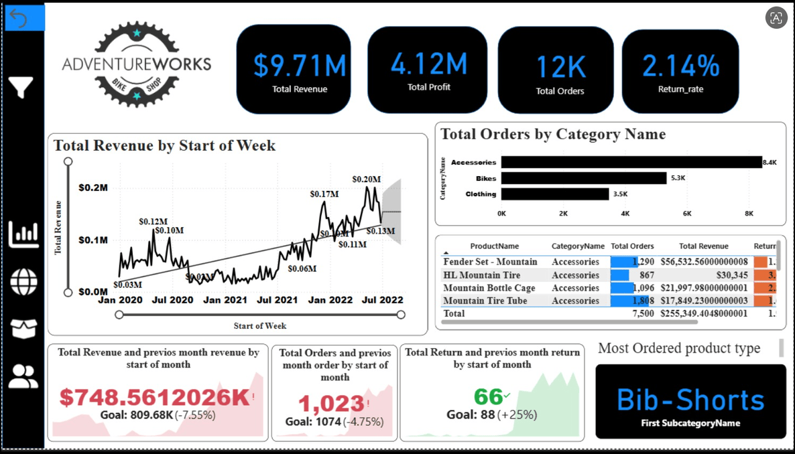
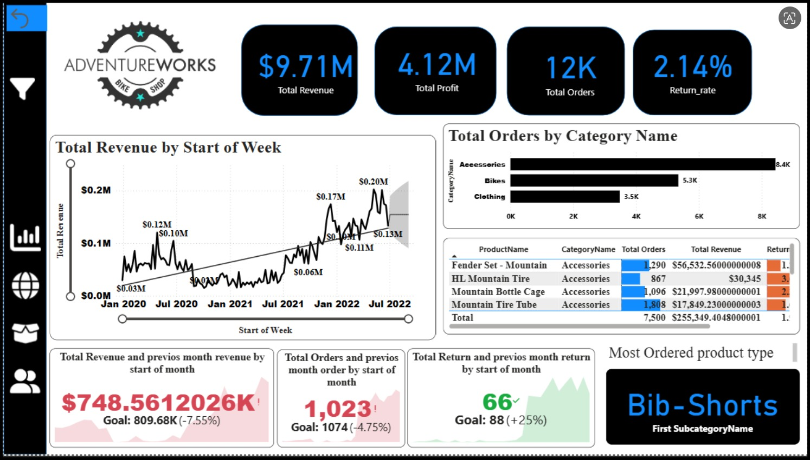
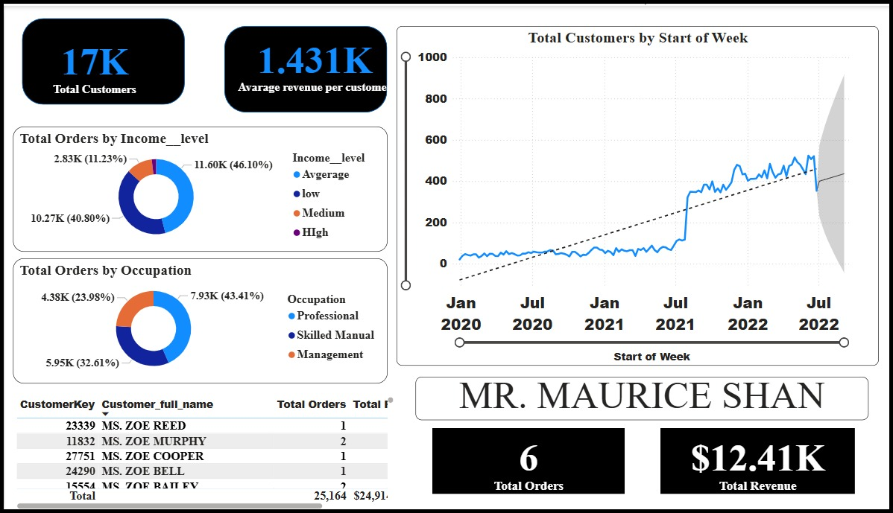
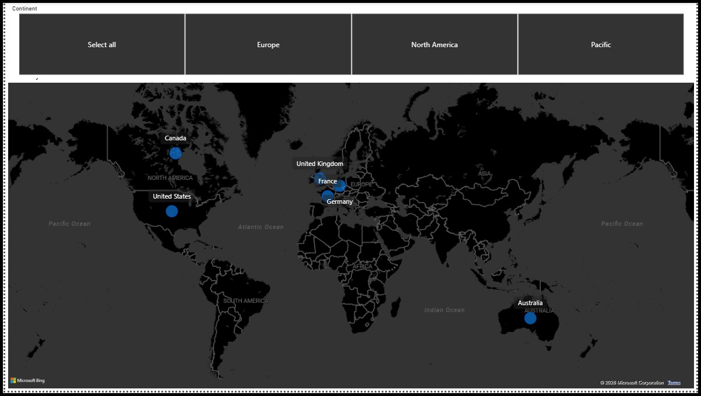
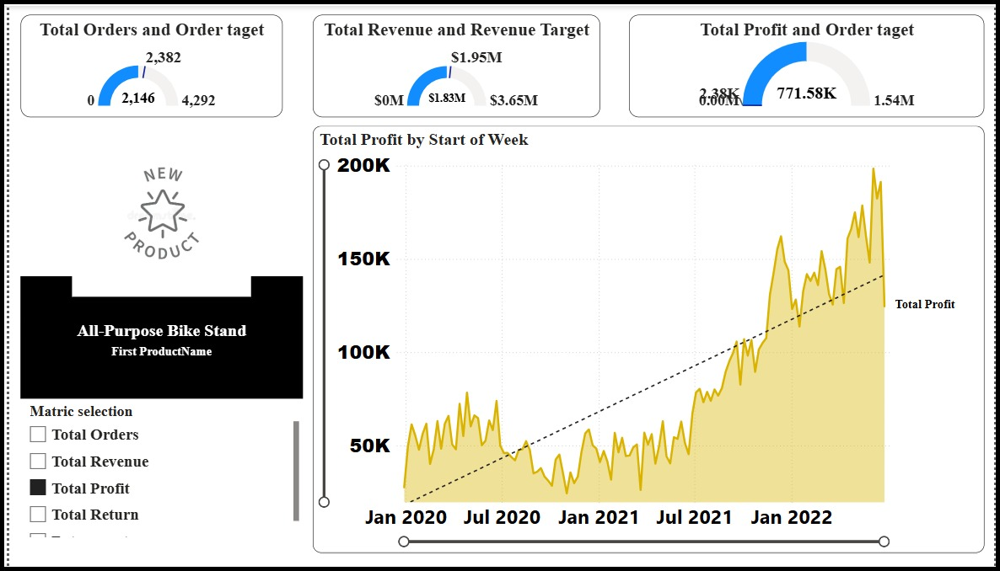

# 🚴 AdventureWorks Sales Dashboard  

  
  
  
  

  

---

# 📌 Project Overview

🚀 This project is a **Sales Analytics Dashboard** built using AdventureWorks dataset to analyze:

- 💰 Revenue performance  
- 📦 Orders & Profit trends  
- 🌍 Global sales distribution  
- 🛍️ Product-level insights  
- 👥 Customer segmentation  

The dashboard provides **business-driven insights** with a clean and modern UI design.

---

# 📸 Dashboard Screenshots

## 🏠 Overview Dashboard

🔍 **Description:**
- Displays overall business performance  

📊 **Key Metrics:**
- 💰 Revenue: **$9.71M**  
- 📈 Profit: **4.12M**  
- 📦 Orders: **12K**  
- 🔁 Return Rate: **2.14%**  

👉 **Insight:** Strong revenue with controlled return rate.

---

## 👥 Customer Analysis

🔍 **Description:**
- Focuses on customer behavior and segmentation  

📊 **Key Metrics:**
- Total Customers: **17K**  
- Avg Revenue per Customer: **1.431K**  

### Insights:
- Income-level based order distribution  
- Occupation-based purchasing trends  
- Customer-level order tracking  

👉 **Insight:** Average-income customers contribute highest orders.

---

## 🌍 Global Sales Analysis

🔍 **Description:**
- Visualizes sales distribution across countries  

📊 **Regions Covered:**
- North America  
- Europe  
- Pacific  

👉 **Insight:** North America and Europe dominate sales.

---

## 🛍️ Product & Profit Analysis

🔍 **Description:**
- Deep dive into product performance and profitability  

📊 **Highlights:**
- Top Category: **Accessories**  
- Most Ordered Product Type  
- Profit trend over time  

👉 **Insight:** Accessories generate highest order volume.

---

# 🎯 Objectives

✔ Analyze revenue and profit trends  
✔ Identify top-performing products  
✔ Understand customer segmentation  
✔ Track global sales performance  
✔ Provide actionable business insights  

---

# 📊 Key Insights

🔥 Revenue reached **$9.71M**  
📦 Accessories category leads sales  
🌍 North America dominates revenue  
👥 Average-income customers are key contributors  
📈 Profit shows strong upward trend  

---

# 🎨 Design & UI Highlights

### ✨ Visual Design
- Dark + light contrast theme  
- Clean KPI cards  
- Professional dashboard layout  

### 🧩 Layout Features
- Multi-page navigation  
- Interactive filters (continent, metrics)  
- Clear visual hierarchy  

### 📊 Charts Used
- Line charts → Trend analysis  
- Bar charts → Category comparison  
- Donut charts → Distribution  
- Map → Geographic analysis  
- Tables → Detailed breakdown  

---

# 🛠️ Tech Stack

| Tool | Purpose |
|------|--------|
| Power BI 📊 | Dashboard Development |
| Python 🐍 | Data Preparation |
| Pandas 📈 | Data Analysis |
| DAX 📐 | Calculations & Measures |

---

# 📂 Dataset

📥 AdventureWorks Dataset (Sample Data for Analytics)

---

# 📈 Business Value

- Helps businesses track **sales & profit performance**  
- Identifies **top customers and products**  
- Supports **data-driven decision making**  
- Improves **market targeting strategies**  

---

# 🚀 Future Enhancements

- 🤖 Predictive analytics (sales forecasting)  
- 📡 Real-time data integration  
- 🎯 Customer recommendation system  
- 📊 Advanced drill-down analysis  

---

## 👤 Author

**Tushar Vala**  
📊 Data Science Enthusiast  
🐍 Python | Pandas | Machine Learning  
